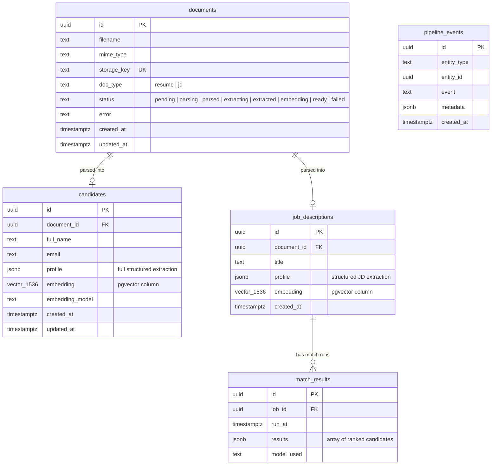

# Database Schema — Entity Relationship Diagram



## Indexes

| Table | Column | Index Type | Purpose |
|---|---|---|---|
| `candidates` | `embedding` | HNSW (`vector_cosine_ops`) | Fast ANN cosine similarity search |
| `candidates` | `profile` | GIN (`jsonb_path_ops`) | Filter by skills, experience, seniority |
| `job_descriptions` | `embedding` | HNSW (`vector_cosine_ops`) | (future: JD similarity) |
| `documents` | `status` | B-tree | Queue worker status polling |
| `documents` | `storage_key` | Unique B-tree | Deduplication |
| `match_results` | `(job_id, run_at)` | Unique B-tree | One result set per job per run |
| `pipeline_events` | `(entity_type, entity_id)` | B-tree | Audit log lookup |

## JSONB Profile Shape

### Candidate Profile (`candidates.profile`)

```json
{
  "fullName": "Jane Smith",
  "email": "jane@example.com",
  "currentTitle": "Senior Software Engineer",
  "totalYearsExperience": 8,
  "seniorityLevel": "senior",
  "skills": [
    { "name": "TypeScript", "category": "technical", "proficiency": "expert" }
  ],
  "workExperience": [
    {
      "company": "Acme Corp",
      "title": "Lead Engineer",
      "startDate": "2021-01",
      "endDate": "2026-01",
      "description": "Led migration to microservices...",
      "technologies": ["TypeScript", "Kubernetes", "PostgreSQL"]
    }
  ],
  "education": [
    { "institution": "MIT", "degree": "B.S.", "field": "Computer Science", "graduationYear": 2017 }
  ],
  "certifications": ["AWS Solutions Architect"],
  "languages": ["English", "Spanish"],
  "summary": "Senior full-stack engineer with 8 years TypeScript..."
}
```

### Job Description Profile (`job_descriptions.profile`)

```json
{
  "jobTitle": "Principal Software Engineer",
  "department": "Platform Engineering",
  "requiredSkills": [
    { "name": "TypeScript", "required": true },
    { "name": "React", "required": true }
  ],
  "preferredSkills": ["Kubernetes", "Go"],
  "minYearsExperience": 7,
  "maxYearsExperience": 12,
  "educationRequirement": "B.S. Computer Science or equivalent",
  "responsibilities": ["Lead architecture decisions", "Mentor junior engineers"],
  "industry": "FinTech",
  "seniority": "principal",
  "summary": "We are looking for a principal engineer to lead..."
}
```

### Match Results (`match_results.results`)

```json
[
  {
    "rank": 1,
    "candidateId": "uuid",
    "matchScore": 0.94,
    "vectorSimilarity": 0.88,
    "strengths": ["8 years TypeScript", "led cloud migration"],
    "gaps": ["No Kubernetes listed"],
    "reasoning": "Jane's deep TypeScript background closely aligns..."
  }
]
```
