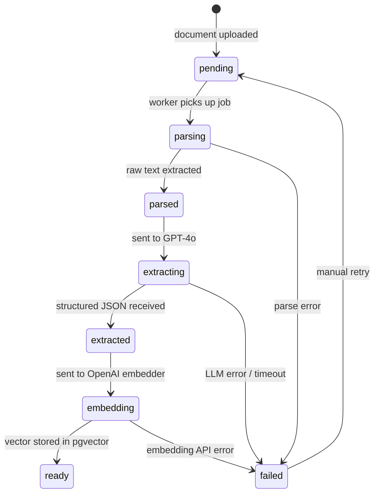
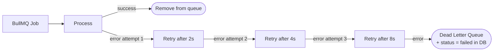

# Ingestion Pipeline — Flow Diagram

```mermaid
flowchart TD
    A([Client: POST /api/uploads\nPDF or DOCX file]) --> B{Validate file\nMIME + size ≤ 10MB}
    B -- invalid --> C([400 Bad Request])
    B -- valid --> D[Store raw file\nMinIO / S3]
    D --> E[INSERT documents\nstatus = pending]
    E --> F[Enqueue BullMQ job\ningestion queue]
    F --> G([202 Accepted\n{documentId, status: queued}])

    subgraph Worker["BullMQ Worker (async)"]
        H[Dequeue job\n{documentId}] --> I[Fetch file\nfrom MinIO / S3]
        I --> J{Select parser\nfrom registry}
        J -- PDF --> K[pdf-parse\nraw text]
        J -- DOCX --> L[mammoth\nraw text]
        J -- future --> M[...]
        K --> N[UPDATE status = extracting]
        L --> N
        M --> N
        N --> O[OpenAI GPT-4o\nStructured JSON extraction\nskills, experience, education...]
        O --> P{Extraction\nsucceeded?}
        P -- no --> Q[UPDATE status = failed\nlog error]
        P -- yes --> R[UPDATE status = embedding]
        R --> S[Build embedding text\nfrom synthesised summary]
        S --> T[OpenAI text-embedding-3-small\n→ float vector 1536 dims]
        T --> U[INSERT candidates\nprofile JSONB + vector\nUPDATE status = ready]
    end

    F -.-> H
    U --> V([SSE: status = ready\nto browser via GET /api/uploads/:id/status])
```

## Status Transitions



## Retry & Error Handling


