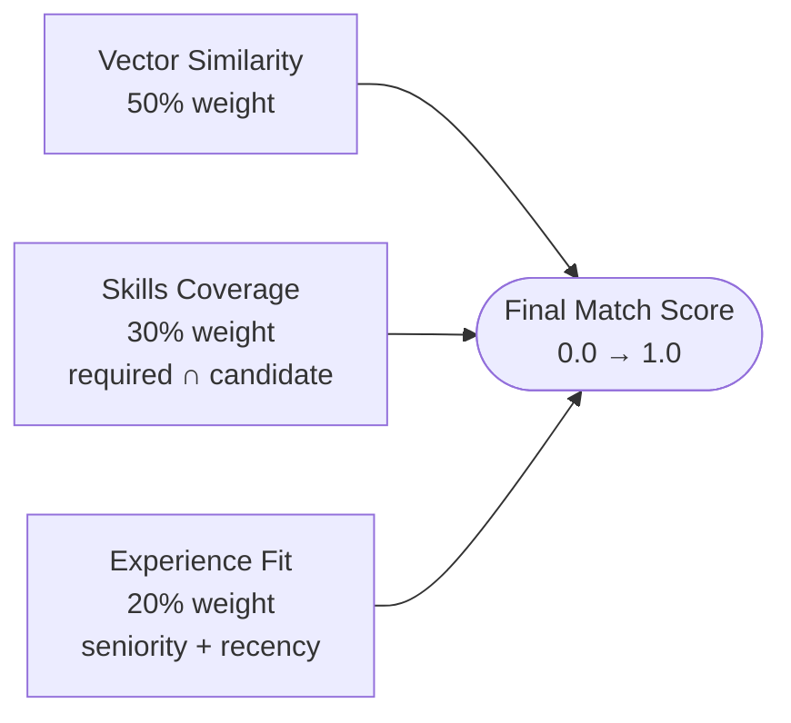
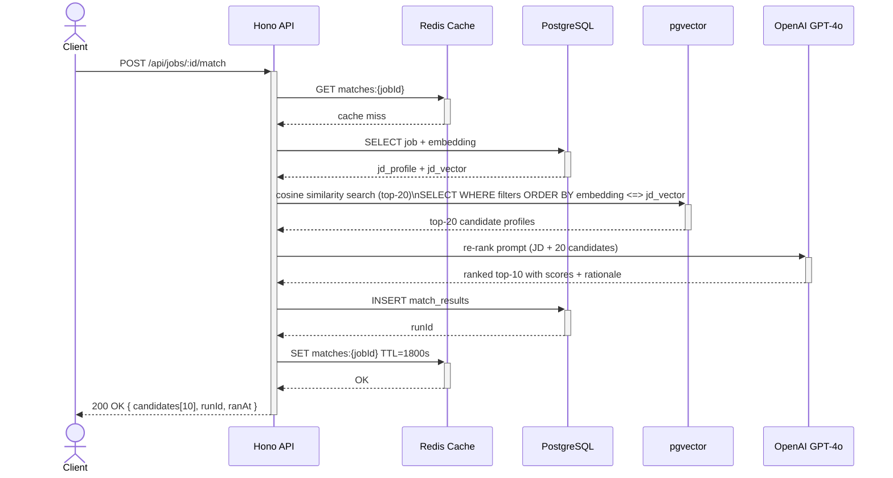

# Matching Pipeline — Flow Diagram

```mermaid
flowchart TD
    A([Client: POST /api/jobs/:id/match]) --> B{Check Redis cache\nmatches:{jobId}}
    B -- cache hit --> C([Return cached top-10\n< 100ms])
    B -- cache miss --> D[Fetch JD profile + embedding\nfrom PostgreSQL]
    D --> E{JD already\nembedded?}
    E -- no --> F[OpenAI text-embedding-3-small\nEmbed JD summary]
    F --> G[Store JD embedding\nin job_descriptions]
    E -- yes --> H

    G --> H[Hard filters\nExperience band + seniority\nSQL WHERE on JSONB profile]
    H --> I[pgvector cosine similarity\nSELECT top-20\nORDER BY embedding ≤ jd_vector]

    subgraph VectorSearch["pgvector (HNSW index)"]
        I
    end

    I --> J[Fetch full candidate profiles\nfor top-20 IDs]
    J --> K[Build re-ranking prompt\nJD + 20 candidate profiles]
    K --> L[OpenAI GPT-4o\nRe-rank → top 10\nwith scores + rationale]

    subgraph LLMRerank["LLM Re-ranking"]
        L
    end

    L --> M{Re-rank\nsucceeded?}
    M -- error --> N[Fallback: use vector\nsimilarity order directly]
    M -- success --> O[INSERT match_results\njob_id + results JSONB]
    N --> O
    O --> P[SET Redis cache\nmatches:{jobId} TTL 30min]
    P --> Q([200 OK\nTop-10 ranked candidates\nwith scores + reasoning])
```

## Scoring Formula



## Cache Invalidation

```mermaid
flowchart TD
    E1([New candidate uploaded]) --> I1[Flush candidates:page:*]
    E2([Candidate profile updated]) --> I2[Flush embedding:{candidateId}\nFlush matches:*]
    E3([JD updated]) --> I3[Flush jd-profile:{jobId}\nFlush matches:{jobId}]
    E4([Explicit re-run requested]) --> I4[Flush matches:{jobId}]
```

## Sequence: Full Matching Flow


