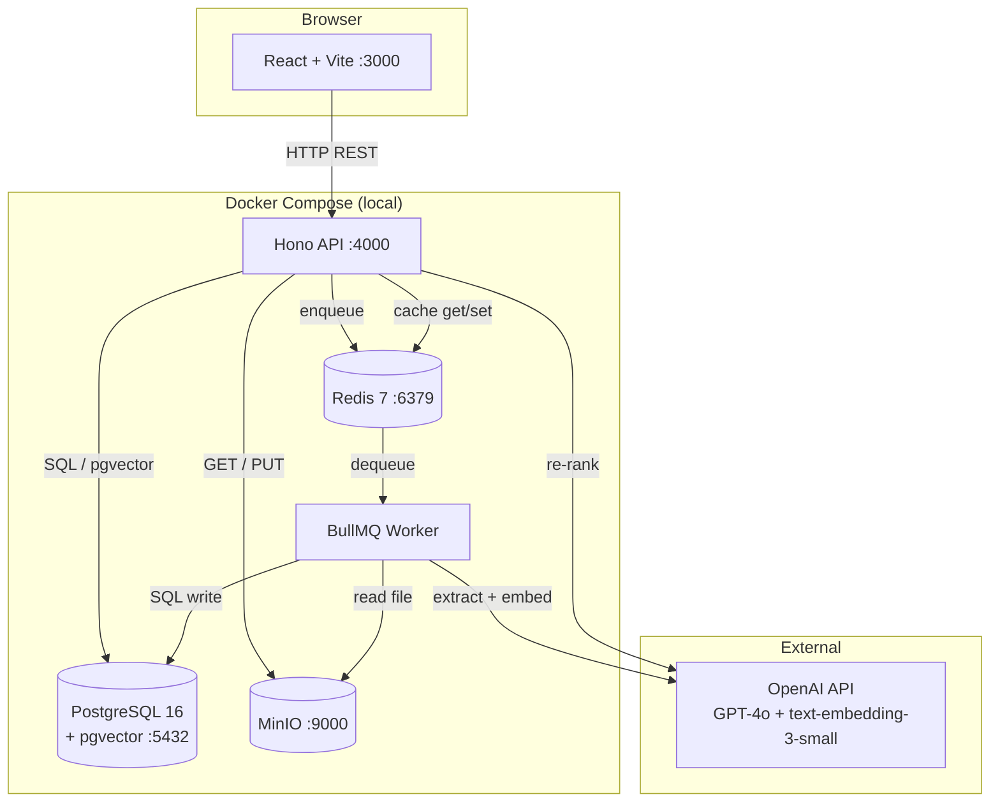
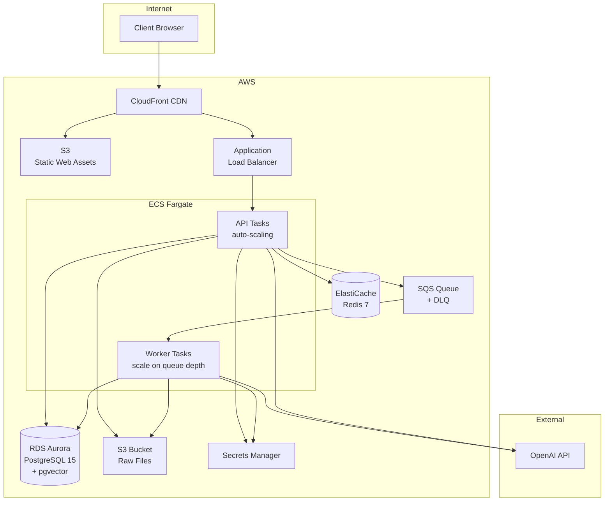

# System Architecture Diagram

## Local (Docker Compose)

```mermaid
graph TB
    subgraph Browser
        UI[React + Vite :3000]
    end

    subgraph Docker["Docker Compose (local)"]
        API[Hono API :4000]
        PG[(PostgreSQL 16\n+ pgvector :5432)]
        REDIS[(Redis 7 :6379)]
        MINIO[(MinIO :9000)]
        WORKER[BullMQ Worker]
    end

    subgraph External
        OPENAI[OpenAI API\nGPT-4o + text-embedding-3-small]
    end

    UI -->|HTTP REST| API
    API -->|SQL / pgvector| PG
    API -->|GET / PUT| MINIO
    API -->|enqueue| REDIS
    REDIS -->|dequeue| WORKER
    WORKER -->|SQL write| PG
    WORKER -->|read file| MINIO
    WORKER -->|extract + embed| OPENAI
    API -->|re-rank| OPENAI
    API -->|cache get/set| REDIS
```

## Production (AWS)

```mermaid
graph TB
    subgraph Internet
        USER[Client Browser]
    end

    subgraph AWS
        CF[CloudFront CDN]
        S3WEB[S3\nStatic Web Assets]
        ALB[Application\nLoad Balancer]

        subgraph ECS["ECS Fargate"]
            APITASK[API Tasks\nauto-scaling]
            WRKRTASK[Worker Tasks\nscale on queue depth]
        end

        AURORA[(RDS Aurora\nPostgreSQL 15\n+ pgvector)]
        ELASTICACHE[(ElastiCache\nRedis 7)]
        S3FILES[S3 Bucket\nRaw Files]
        SQS[SQS Queue\n+ DLQ]
        SM[Secrets Manager]
    end

    subgraph External
        OPENAI[OpenAI API]
    end

    USER --> CF
    CF --> S3WEB
    CF --> ALB
    ALB --> APITASK
    APITASK --> AURORA
    APITASK --> ELASTICACHE
    APITASK --> S3FILES
    APITASK --> SQS
    SQS --> WRKRTASK
    WRKRTASK --> AURORA
    WRKRTASK --> S3FILES
    WRKRTASK --> OPENAI
    APITASK --> OPENAI
    APITASK --> SM
    WRKRTASK --> SM
```
